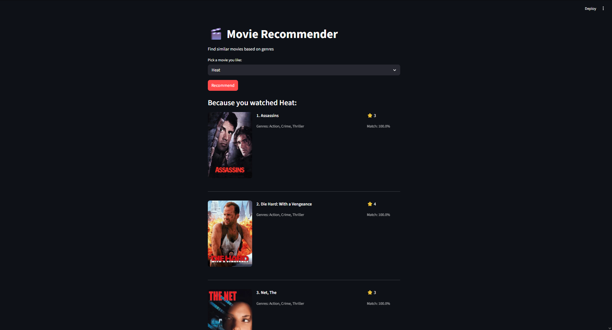

# Movie Recommender

[](https://www.python.org/)
[](https://streamlit.io/)
[](https://scikit-learn.org/)
[](https://opensource.org/licenses/Apache-2.0)

A modular movie recommendation system built with Python, Streamlit, and MovieLens data.

This project demonstrates an end-to-end ML product workflow:

- data ingestion and cleaning,
- model training and artifact management,
- offline quality evaluation,
- user-facing recommendation app with optional poster previews.

---

## Why this project

The goal is to build a practical recommendation MVP that is:

- easy to run locally,
- structured for iteration,
- measurable with explicit ranking metrics,
- ready to evolve from baseline to stronger models.

---

## Demo

### App capabilities

- Select any movie from the dataset.
- Get top-N similar movie recommendations.
- View similarity score and movie rating.
- Show posters when TMDB API key is configured.

### Screenshot





---

## Feature Highlights

- **Content-based recommendation engine** using genre vectors + cosine similarity.
- **Modular codebase** under `src/` for clean separation of data/model/eval/app layers.
- **Reproducible training pipeline** with artifact generation.
- **Offline evaluation** with Hit Rate@K, Precision@K, Recall@K, Coverage, and Novelty.
- **Streamlit frontend** for interactive recommendations.
- **Optional TMDB integration** for poster rendering.

---

## Tech Stack

- Python 3.8+
- Streamlit
- Pandas
- NumPy
- Scikit-learn
- Requests (TMDB API calls)

---

## Project Structure

```text
movie-recommender/
├── app.py                         # Streamlit app UI + inference rendering
├── train.py                       # Train pipeline entrypoint
├── evaluate.py                    # Evaluation entrypoint
├── requirements.txt
├── setup.py
├── artifacts/                     # Generated model artifacts + reports
├── data/                          # Raw/processed datasets
├── notebooks/                     # EDA and experimentation notebooks
└── src/
    └── movie_recommender/
        ├── __init__.py
        ├── data.py                # Data prep / SQLite creation
        ├── model.py               # Model train, recommend, save/load artifacts
        ├── pipeline.py            # Training orchestration
        └── evaluate.py            # Ranking metrics evaluation
```

---

## Architecture at a glance

1. **Prepare data** from MovieLens CSVs into `data/movies.db`.
2. **Train model** from movie genres using CountVectorizer + cosine similarity.
3. **Persist artifacts** (`.pkl`, `.npz`, `metadata.json`) in `artifacts/`.
4. **Run offline evaluation** on user interactions from ratings.
5. **Serve recommendations** in Streamlit with optional poster enrichment from TMDB.

---

## Quick Start

### 1) Install dependencies

```bash
pip install -r requirements.txt
```

### 2) (Optional) Enable posters with TMDB

Create `.streamlit/secrets.toml`:

```toml
TMDB_API_KEY = "your_tmdb_api_key"
```

If the key is missing, the app still works and only poster rendering is disabled.

### 3) Train / regenerate artifacts

```bash
python train.py
```

To force rebuilding DB before training:

```bash
python train.py --rebuild-db
```

### 4) Run offline evaluation

```bash
python evaluate.py --top-k 10 --min-user-interactions 5
```

Output report:

`artifacts/evaluation_report.json`

### 5) Launch Streamlit app

```bash
streamlit run app.py
```

---

## Baseline Results

Latest baseline (`top_k=10`, `min_user_interactions=5`):

| Metric            |  Value |
| ----------------- | -----: |
| Queries evaluated |    610 |
| Hit Rate@10       | 0.0066 |
| Precision@10      | 0.0007 |
| Recall@10         | 0.0066 |
| Coverage          | 0.1761 |
| Novelty           | 13.225 |

### Interpretation

- The current model is intentionally a simple baseline focused on genre similarity.
- It offers a solid foundation for quality upgrades (tags, year/title features, hybrid ranking).

---

## Data

- MovieLens dataset: `data/ml - 1m/`
- Local DB cache: `data/movies.db`
- Additional metadata: `data/movie_metadata.csv`

---

## Roadmap

- Add richer content features (tags + title/year signals)
- Explore hybrid recommender (content + collaborative signals)
- Introduce tests for core pipeline and app inference path
- Add CI checks for lint, train smoke test, and evaluation smoke test
- Improve recommendation explainability in UI (why this was recommended)

---

## Contributing

Contributions are welcome.

Please open an issue with:

- a clear problem statement,
- proposed change,
- validation plan (metric, UX, or performance impact).

---

## Security & Notes

- Keep secrets in `.streamlit/secrets.toml` (already git-ignored).
- Artifacts in `artifacts/` are generated and can be recreated via `train.py`.
