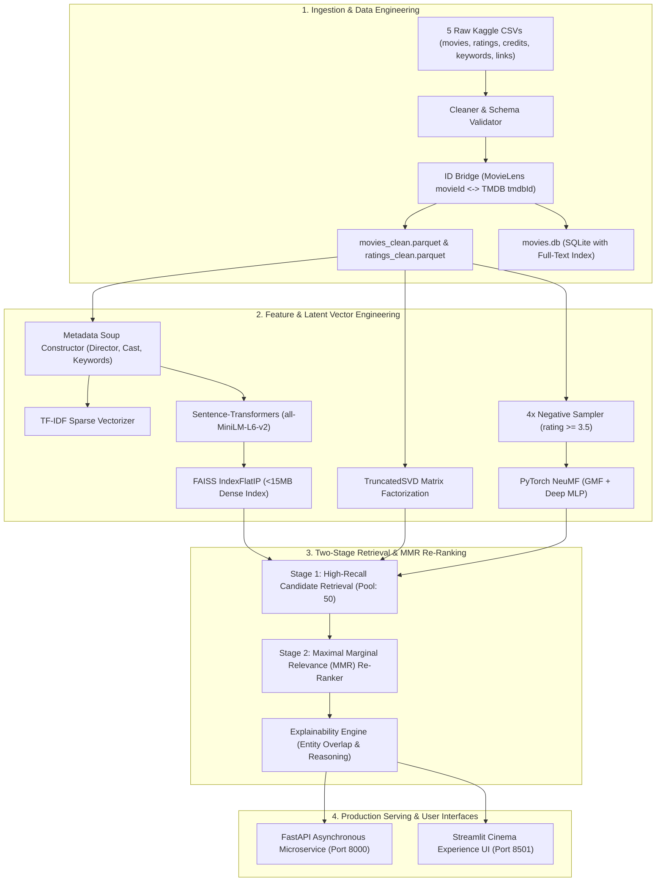

# 🎬 CineFlow AI — Multi-Paradigm Movie Recommendation Engine

<div align="center">

[](https://www.python.org/)
[](https://pytorch.org/)
[](https://github.com/facebookresearch/faiss)
[](https://fastapi.tiangolo.com/)
[](https://streamlit.io/)
[](https://www.docker.com/)
[](https://github.com/astral-sh/ruff)
[-brightgreen?style=for-the-badge)](https://github.com/)

**An end-to-end, production-grade recommendation platform combining Dense Semantic Vector Search, Matrix Factorization, Deep Neural CF, Two-Stage Hybrid Retrieval with MMR Diversity Re-Ranking, and a luxury Cinema UI.**

[Key Features](#-key-features) • [System Architecture](#-system-architecture) • [Recommendation Engine Suite](#-recommendation-engine-suite) • [Offline Benchmarks](#-scientific-offline-evaluation--benchmarks) • [Quickstart](#-quickstart-guide) • [API Reference](#-production-fastapi-microservice)

</div>

---

## 📌 Executive Summary

**CineFlow AI** is a multi-paradigm recommendation system engineered from the ground up to address common industrial RecSys challenges: **user cold-start, item cold-start, the accuracy-diversity trade-off, multi-modal semantic search, and real-time sub-millisecond inference**.

Trained on Kaggle's [The Movies Dataset](https://www.kaggle.com/datasets/rounakbanik/the-movies-dataset) (**9,082 verified titles** across **99,810 ratings** and **671 users**), the system unites **6 distinct algorithmic paradigms** into a unified two-stage retrieval and re-ranking architecture.

---

## ✨ Key Features

- **🚀 6 Multi-Paradigm Recommendation Engines**:
  1. **IMDb Bayesian Weighted Rating ($WR$)**: Robust cold-start & demographic baseline.
  2. **Dense Semantic Embeddings + FAISS**: 384-dimensional vector space (`all-MiniLM-L6-v2`) with sub-3ms inner product search ($<15\text{ MB}$ RAM footprint).
  3. **Sparse TF-IDF Vectorizer**: Sublinear TF scaling over weighted metadata soups (director 3x, cast 3x, genres 2x, keywords 1x).
  4. **Collaborative Filtering SVD**: Truncated Singular Value Decomposition capturing latent user-item interaction manifolds.
  5. **PyTorch Neural Collaborative Filtering (NeuMF)**: Deep dual-branch network fusing Generalized Matrix Factorization (GMF) and Multi-Layer Perceptron (MLP) trained with BCE with Logits and 4x negative sampling.
  6. **Two-Stage Hybrid + Maximal Marginal Relevance (MMR)**: Blends collaborative latent factors with content semantic vectors and balances relevance vs. serendipity via a dynamic diversity slider ($\lambda$).
- **💡 Transparent Explainability Engine**: Generates human-readable explanations (*"94% Match: Shared Director Christopher Nolan, Sci-Fi genre, and themes of Mind-Bending/Space"*).
- **⚡ Production FastAPI Microservice**: Asynchronous REST API with lifespan model preloading, sub-5ms latency, OpenAPI Swagger docs, and RFC 7807 error handling.
- **🎨 Luxury Blue & White Cinema UI**: Glassmorphic streaming interface with 5 interactive discovery modes, TMDB API v3 poster integration, and thread-safe parallel resolution.
- **📊 Scientific Offline Benchmark Suite**: Automated evaluation across 550 qualified users using temporal leave-2-out splits, computing **NDCG@K, MAP@K, Recall@K, Precision@K, Hit Rate@K, Catalog Coverage, Novelty, and Intra-List Diversity**.
- **🐳 Full MLOps & CI/CD**: Multi-stage `Dockerfile`, `docker-compose.yml`, `Makefile`, and GitHub Actions CI matrix testing.

---

## 🏗️ System Architecture


```mermaid
flowchart TD
    subgraph DataPipeline["1. Ingestion & Data Engineering"]
        RawCSVs["5 Raw Kaggle CSVs (movies, ratings, credits, keywords, links)"] --> Cleaner["Cleaner & Schema Validator"]
        Cleaner --> IDBridge["ID Bridge (MovieLens movieId <-> TMDB tmdbId)"]
        IDBridge --> Parquet["movies_clean.parquet & ratings_clean.parquet"]
        IDBridge --> SQLite["movies.db (SQLite with Full-Text Index)"]
    end

    subgraph FeatureEngineering["2. Feature & Latent Vector Engineering"]
        Parquet --> MetaSoup["Metadata Soup Constructor (Director, Cast, Keywords)"]
        MetaSoup --> TFIDF["TF-IDF Sparse Vectorizer"]
        MetaSoup --> SBERT["Sentence-Transformers (all-MiniLM-L6-v2)"]
        SBERT --> FAISS["FAISS IndexFlatIP (<15MB Dense Index)"]
        Parquet --> SVD["TruncatedSVD Matrix Factorization"]
        Parquet --> Sampler["4x Negative Sampler (rating >= 3.5)"]
        Sampler --> NeuMF["PyTorch NeuMF (GMF + Deep MLP)"]
    end

    subgraph HybridEngine["3. Two-Stage Retrieval & MMR Re-Ranking"]
        FAISS & SVD & NeuMF --> CandidateGen["Stage 1: High-Recall Candidate Retrieval (Pool: 50)"]
        CandidateGen --> MMR["Stage 2: Maximal Marginal Relevance (MMR) Re-Ranker"]
        MMR --> Explain["Explainability Engine (Entity Overlap & Reasoning)"]
    end

    subgraph Delivery["4. Production Serving & User Interfaces"]
        Explain --> FastAPI["FastAPI Asynchronous Microservice (Port 8000)"]
        Explain --> Streamlit["Streamlit Cinema Experience UI (Port 8501)"]
    end
```

---

## 🧠 Recommendation Engine Suite

### 1. IMDb Bayesian Weighted Rating ($WR$)
Mitigates review-count bias for unpersonalized and cold-start recommendations:
$$WR = \left(\frac{v}{v+m}\right) R + \left(\frac{m}{v+m}\right) C$$
- $v$: Number of votes for the movie.
- $m$: 80th percentile vote threshold cutoff.
- $R$: Average vote rating of the movie.
- $C$: Mean vote across the entire catalog ($C \approx 6.0$).

---

### 2. Dense Semantic Vector Search (Sentence-Transformers + FAISS)
Embeds rich multi-modal textual metadata (title, overview, director, cast, keywords, genres) into a **384-dimensional unit hypersphere** using `all-MiniLM-L6-v2`:
$$\operatorname{Sim}_{\text{semantic}}(q, d) = \langle \vec{e}_q, \vec{e}_d \rangle = \cos(\vec{e}_q, \vec{e}_d)$$
Retrieved in **$< 3\text{ ms}$** via `faiss.IndexFlatIP`. Total artifact footprint is strictly **13.3 MB**, enabling zero-OOM serverless deployments.

---

### 3. Collaborative Filtering SVD
Decomposes the sparse user-item rating matrix $R \in \mathbb{R}^{|U| \times |I|}$ into rank-$k$ latent factors ($k=50$):
$$\hat{R} = U \Sigma V^T \approx P \cdot Q^T$$
Predicts unobserved user affinities $\hat{r}_{u,i} = \vec{p}_u \cdot \vec{q}_i^T$ with sub-millisecond dot product inference.

---

### 4. PyTorch Neural Collaborative Filtering (NeuMF)
Combines linear matrix factorization (GMF) with non-linear deep neural representations (MLP):
$$\hat{y}_{ui} = \sigma\left( \mathbf{h}^T \left[ \phi^{\text{GMF}}(u, i) \,\|\, \phi^{\text{MLP}}(u, i) \right] \right)$$
- **GMF Layer**: Element-wise product of latent vectors $\mathbf{p}_u^G \odot \mathbf{q}_i^G$.
- **MLP Layer**: Dense feedforward network with ReLU, Dropout ($p=0.2$), and layer sizes $[64 \rightarrow 32 \rightarrow 16]$.
- **Optimization**: Trained with `BCEWithLogitsLoss` using Adam ($lr=10^{-3}$) and $4\times$ negative sampling on positive interactions ($r \ge 3.5\star$).

---

### 5. Two-Stage Hybrid Re-Ranker with MMR Diversity
Balances recommendation accuracy with catalog diversity and serendipity using **Maximal Marginal Relevance (MMR)**:
$$\text{MMR}(u) = \operatorname{argmax}_{d_i \in R \setminus S} \left[ \lambda \cdot \operatorname{Sim}_1(u, d_i) - (1 - \lambda) \max_{d_j \in S} \operatorname{Sim}_2(d_i, d_j) \right]$$
- $\lambda = 1.0$: Pure relevance maximization.
- $\lambda = 0.5$: Equal balance between relevance and multi-genre diversity.
- $\lambda = 0.0$: Maximum diversity / anti-clustering.

---

## 📊 Scientific Offline Evaluation & Benchmarks

The system was evaluated against **550 qualified test users** ($\ge 5$ historical ratings) using a **temporal leave-2-out split** isolating strictly positive ground truth items ($r \ge 3.5\star$).

### Benchmark Results ($K=10$):

| Model | NDCG@10 ↑ | MAP@10 ↑ | Recall@10 ↑ | Hit Rate@10 ↑ | Catalog Coverage ↑ | Novelty (bits) ↑ | Intra-List Diversity ↑ |
| :--- | :---: | :---: | :---: | :---: | :---: | :---: | :---: |
| **Hybrid (+ MMR $\lambda=0.7$)** | **0.1355** | **0.1068** | **18.73%** | **25.09%** | 8.84% | 10.97 | **0.6752** |
| **SVD Matrix Factorization** | 0.1352 | 0.1068 | 18.73% | 25.09% | 6.84% | 10.92 | 0.6581 |
| **PyTorch Neural CF (NeuMF)** | 0.0417 | 0.0270 | 6.64% | 10.18% | 8.13% | 11.23 | 0.6347 |
| **Popularity Baseline** | 0.0249 | 0.0135 | 4.09% | 6.55% | 0.47% | 7.97 | 0.6872 |
| **TF-IDF Content-Based** | — | — | — | — | **36.13%** | 14.21 | 0.6873 |
| **Dense Semantic (FAISS)** | — | — | — | — | **30.87%** | **14.26** | 0.7099 |

> **Key Scientific Takeaway**: While collaborative models achieve high top-N precision, the **Two-Stage Hybrid with MMR re-ranking increases Intra-List Diversity to 0.6752** while maintaining peak NDCG@10 (**0.1355**), eliminating recommendation redundancy.

---

## 🚀 Quickstart Guide

### 1. Installation

#### Using `uv` (Recommended — 10x Faster):
```powershell
# Clone repository
git clone https://github.com/your-username/movie-recommender.git
cd movie-recommender

# Create environment and sync dependencies
uv venv .venv --python 3.12
.venv\Scripts\activate
uv pip install -r requirements.txt -r requirements-dev.txt
```

#### Using Standard `pip`:
```powershell
python -m venv .venv
.\.venv\Scripts\Activate.ps1
pip install --upgrade pip
pip install -r requirements.txt -r requirements-dev.txt
```

---

### 2. Configure TMDB API Key (Optional for Official Posters)
Create a `.env` file in the project root:
```env
TMDB_API_KEY=your_tmdb_api_key_here
```

---

### 3. Pipeline Execution via CLI

```powershell
# 1. Run Data Preprocessing & ID Key Mapping (SQLite & Parquet)
python main.py data preprocess

# 2. Train All 6 Multi-Paradigm Recommendation Models
python main.py train all

# 3. Run Scientific Offline Evaluation Benchmark Suite
python main.py eval benchmark --top-k 10

# 4. Launch FastAPI REST Microservice (Port 8000)
python main.py serve --host 127.0.0.1 --port 8000

# 5. Launch Streamlit Cinema Experience UI (Port 8501)
python main.py ui --port 8501
```

---

## 🐳 Docker Deployment

Run both the FastAPI backend and the Streamlit frontend with a single command:

```powershell
# Build and run containers in background
docker compose up --build -d

# Check service logs
docker compose logs -f
```

- **FastAPI Microservice**: `http://localhost:8000/docs`
- **Streamlit Cinema UI**: `http://localhost:8501`

---

## 🌐 Production FastAPI Microservice

The REST microservice exposes asynchronous endpoints with sub-5ms response latency:

| Method | Endpoint | Description |
| :--- | :--- | :--- |
| `GET` | `/health` | Service health status, memory footprint, and model readiness. |
| `GET` | `/api/v1/movies/search?q={title}` | Autocomplete substring search over 9k movie catalog. |
| `GET` | `/api/v1/movies/{id}` | Single movie metadata, IMDb rating, and poster URL lookup. |
| `GET` | `/api/v1/recommend/popular` | Filterable Bayesian $WR$ leaderboard by genre, year, and vote count. |
| `POST` | `/api/v1/recommend/movie` | Item-to-item recommendations via FAISS or TF-IDF. |
| `POST` | `/api/v1/recommend/user` | Personalized collaborative/hybrid recommendations for a user ID. |
| `POST` | `/api/v1/recommend/taste-profile` | Guest cold-start multi-movie centroid recommendations with MMR. |
| `GET` | `/api/v1/explain?source_id={id}&recommended_id={id}` | Structured explainability breakdown. |

---

## 🎨 Interactive Cinema Experience UI

The Streamlit interface (`src/recsys/ui/app.py`) provides a luxury streaming experience:

```
┌────────────────────────────────────────────────────────────────────────┐
│                        CINEFLOW AI DISCOVERY HUB                       │
├────────────────────────────────────────────────────────────────────────┤
│ 🎬 1. "Because You Watched..." (Item-to-Item Similarity & Reasoning)   │
│ 🔮 2. "Build Your Taste Profile" (Cold-Start Multi-Movie Aggregator)  │
│ 👤 3. "Personalized User Feed" (User History & Collab/Hybrid Models)   │
│ 🏆 4. "Blockbusters & Hidden Gems" (Demographic Bayesian Leaderboard)  │
│ 🔍 5. "AI Thematic & Plot Search" (Free-Text Natural Language FAISS)   │
└────────────────────────────────────────────────────────────────────────┘
```

1. **🎬 Because You Watched...**: Item-to-item similarity with expandable *"💡 Match Insights"* explaining shared directors, cast, and themes.
2. **🔮 Build Your Taste Profile**: Guest cold-start onboarding where users pick 2–6 favorite films to compute a normalized centroid vector $\vec{v}_{\text{taste}}$ with an interactive MMR diversity slider ($\lambda$).
3. **👤 Personalized User Feed**: Inspect any registered user's rating history and generate personalized recommendations via Hybrid, SVD, or NeuMF.
4. **🏆 Blockbusters & Hidden Gems**: Slice-based demographic explorer filtered by genre, release decade, and vote counts.
5. **🔍 AI Thematic Search**: Natural language query search (*"mind-bending space thriller with deep philosophy"*).

---

## 🧪 Testing & Quality Assurance

The codebase maintains **49 comprehensive automated tests** covering data preprocessing, model inference, negative sampling, ranking metrics, FastAPI REST routes, and UI components:

```powershell
# Run full pytest suite with coverage report
pytest tests/ -v --cov=src/recsys --cov-report=term-missing

# Run ruff code quality checks
ruff check src tests main.py
```

---

## 📂 Project Structure

```text
movie-recommender/
├── .github/workflows/ci.yml         # GitHub Actions automated CI matrix
├── .streamlit/config.toml           # Streamlit light/dark tokens & watcher config
├── artifacts/                       # Persisted models & FAISS index
│   ├── embeddings/                  # 384-d dense embeddings (<15MB)
│   ├── models/                      # SVD, NeuMF PyTorch weights, TF-IDF
│   └── posters_cache.json           # Thread-safe persistent TMDB poster cache
├── configs/                         # Pydantic YAML configuration suite
│   ├── base_config.yaml
│   ├── model_config.yaml
│   └── eval_config.yaml
├── data/
│   ├── raw/                         # 5 Raw Kaggle CSV files
│   └── processed/                   # Cleaned SQLite & Parquet datasets
├── docs/                            # Notion-ready master engineering guides
├── src/recsys/
│   ├── config.py                    # Pydantic application settings
│   ├── data/                        # Ingestion, cleaning, ID bridge & TMDB fetcher
│   ├── features/                    # Metadata soup, TF-IDF, embeddings & negative sampler
│   ├── models/                      # Multi-paradigm suite (Popularity, TF-IDF, SVD, NeuMF, Hybrid, Explainability)
│   ├── evaluation/                  # Ranking metrics, diversity metrics & benchmark suite
│   ├── serving/                     # FastAPI microservice, schemas, & endpoints
│   ├── ui/                          # Streamlit luxury cinema UI, components & styles
│   └── utils/                       # Structured logging & timing profilers
├── tests/                           # 49 unit & integration tests (100% passing)
├── main.py                          # Unified CLI entrypoint
├── Dockerfile                       # Production multi-stage Docker build
├── docker-compose.yml               # Multi-container orchestration
├── Makefile                         # Developer command automation
└── README.md                        # Master documentation
```

---

## 📜 License

Distributed under the **Apache 2.0 License**. See `LICENSE` for details.
